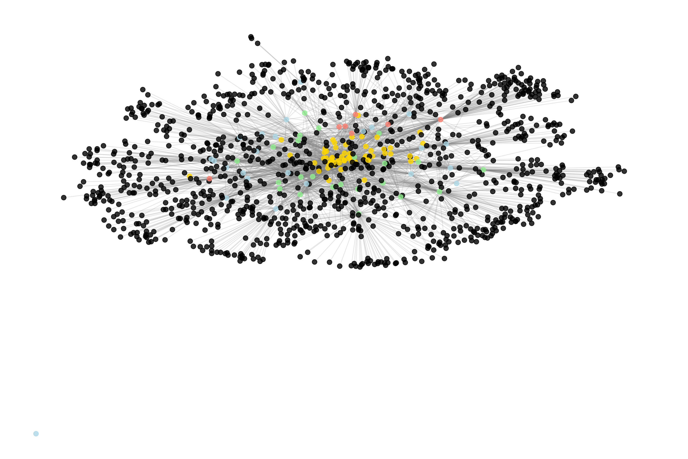
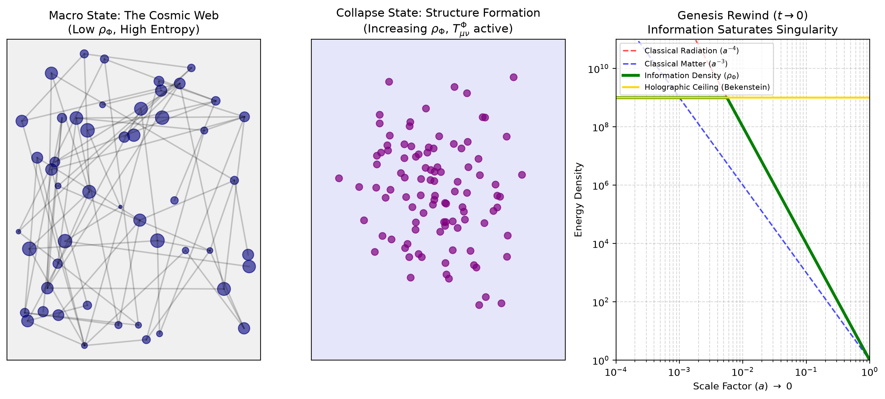
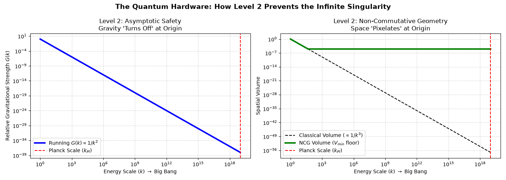

## The Resonance Cartographer

## Mapping the Information Singularity

An exploratory research project mapping resonances between mathematical topology, quantum gravity, and integrated information. The project connects a three-level equation dataset to a speculative account of the universe's earliest boundary conditions.

> - **Explore the data:** Visit the [topological map and seed crystals]({{ '/database' | relative_url }}).
> - **Follow the quantum biology bridge:** Compare [photosynthetic coherence and cosmological decoherence]({{ '/quantum-biology' | relative_url }}).

## The Map

The project begins with 1,979 mathematical equations organized as a topological map across three levels of physical description:

1. **Fundamental physics**: particles, thermodynamics, and quantum ingredients.
2. **Advanced frameworks**: quantum-gravity approaches, including non-commutative geometry and asymptotic safety.
3. **Emergence and intelligence**: self-organizing cosmic structure and integrated information, $\Phi$.

From this map, 57 seed crystals persist across levels. Integrated information, $\Phi$, is the central candidate bridge.

## The Hypothesis

We explore a modified Friedmann equation in which information contributes to the stress-energy budget:

$$
H^2 = \frac{8\pi G}{3}(\rho_m + \rho_\Phi) + \frac{\Lambda}{3}.
$$

In the origin-limit model, classical matter is set to zero, leaving an information-dominated state:

$$
H^2 = \frac{8\pi G}{3}\rho_\Phi.
$$

Using Landauer's principle, $E = k_B T \ln 2$, the model translates this energy density into an information density. This is a speculative mathematical exploration, not an established cosmological model.

## The Genesis Rewind

The visual simulations explore whether a holographic ceiling can keep the information density finite as the scale factor approaches zero.

## Quantum Hardware

Two quantum-gravity frameworks provide the proposed limiting mechanisms:

- **Non-commutative geometry** imposes a minimum spatial volume, preventing the denominator of $\rho_\Phi = \Phi / V$ from vanishing.
- **Asymptotic safety** makes Newton's constant scale-dependent, with $G(k) \to 0$ as the energy scale $k \to \infty$.

Together, these ideas motivate the synthesis:

$$
H^2 = \frac{8\pi G(k)}{3}\left(\frac{\Phi_{\max}}{V_{\min}(\theta)}\right).
$$

The question posed here is whether the Big Bang can be usefully modeled as a finite information boundary rather than an infinite material singularity.

## Repository Contents

- `equations.jsonl`: the equation map used in the exploration.
- `seed_crystals.json`: variables that recur across all three levels.
- `singularity_rewind.py`: symbolic derivation of the information-dominated origin state.
- `holographic_ceiling.py`, `quantum_hardware.py`, and `build_reverse_time.py`: visualization scripts.

## Scope

This repository records an independent, AI-assisted conceptual investigation. Its equations and visualizations should be treated as exploratory material rather than peer-reviewed scientific conclusions.
